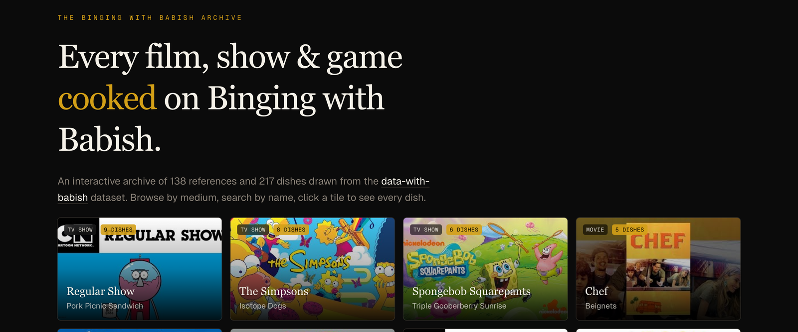

<h1 align="center">BWB Archive</h1>

<p align="center">
  <em>Every film, show &amp; game cooked on Binging with Babish.</em>
</p>

<p align="center">
  <a href="https://github.com/jklewa/babish-archive/actions/workflows/deploy.yml"></a>
  <a href="https://jklewa.github.io/babish-archive/"></a>
  <a href="https://github.com/jklewa/data-with-babish"></a>
</p>

<p align="center">
  <a href="https://jklewa.github.io/babish-archive/">
    
  </a>
</p>

An interactive, searchable archive of every movie, TV show, video game, and other media that has inspired an episode of [Binging with Babish](https://www.bingingwithbabish.com). Browse by medium, search by title or dish, click a tile to see every episode tied to that reference.

> Not affiliated with Andrew Rea or the Babish Culinary Universe — this is a fan-built showcase of the public [`data-with-babish`](https://github.com/jklewa/data-with-babish) dataset.

---

## Features

- **250+ references, 400+ dishes** — films, TV, games, comedy specials, and YouTube channels
- **Filter by medium** with live counts (Movie / TV Show / Video Game / Comedy / YouTube / Other)
- **Fuzzy search** across reference names *and* episode titles — find a dish without remembering the source
- **Per-reference detail pages** with full episode lists, embedded YouTube links, and outbound links to IMDb, Steam, and official sites
- **Statically exported** — no server, no database, deploys anywhere
- **Dark, editorial design** with serif display type, monospace accents, and a responsive grid

## Tech stack

| Layer | Choice |
| --- | --- |
| Framework | [Next.js 16](https://nextjs.org) (App Router, `output: "export"`) |
| UI | [React 19](https://react.dev), [Tailwind CSS 4](https://tailwindcss.com) |
| Language | TypeScript, ESLint 9 |
| Type | [Geist & Geist Mono](https://vercel.com/font) via `next/font` |
| Hosting | GitHub Pages (static) |

The dataset ships as a single JSON file (`data/references.json`); all pages and dynamic routes are pre-rendered at build time via `generateStaticParams`.

## Getting started

Requires Node.js 20+.

```bash
npm install
npm run dev
```

Open <http://localhost:3000>.

### Scripts

| Command | Description |
| --- | --- |
| `npm run dev` | Start the dev server with hot reload |
| `npm run build` | Produce a static export in `out/` |
| `npm run start` | Serve a previously built production app |
| `npm run lint` | Run ESLint |

## Deployment

The repo is wired for GitHub Pages out of the box:

- `output: "export"` writes a static site to `out/`
- `basePath` and `assetPrefix` are scoped to `/babish-archive` in production
- `trailingSlash: true` keeps URLs Pages-friendly
- `images.unoptimized: true` skips the Next image optimizer (required for static export)

To deploy elsewhere, edit `next.config.ts` (the `repo` constant controls the base path) and publish the contents of `out/`.

## Project layout

```
.
├── app/
│   ├── layout.tsx              # Root layout, fonts, metadata
│   ├── page.tsx                # Home — header + Gallery
│   └── reference/[id]/page.tsx # Per-reference detail page (statically generated)
├── components/
│   ├── Gallery.tsx             # Filter + search + grid (client component)
│   └── ReferenceCard.tsx       # Tile rendering
├── data/
│   └── references.json         # The dataset
└── lib/
    └── references.ts           # Types, loader, slugify, helpers
```

## Updating the data

`data/references.json` is sourced from [`jklewa/data-with-babish`](https://github.com/jklewa/data-with-babish). To refresh:

1. Pull the latest export from the upstream dataset.
2. Replace `data/references.json`.
3. Rebuild — `lib/references.ts` handles slugging, sorting, and date ordering.

The loader sorts references by episode count (most-inspired first), then alphabetically; episodes within a reference are sorted newest-first.

## Contributing

Issues and PRs are welcome — especially for:

- Broken images or dead external links (the dataset has a long tail).
- Missing references — please file these against the upstream [data-with-babish](https://github.com/jklewa/data-with-babish) repo first.
- Accessibility, performance, and design polish.

## Acknowledgments

- **Andrew Rea** and the entire Babish Culinary Universe team for years of incredible food content.
- **bingingwithbabish.com** and **YouTube** for the public episode metadata that powers the dataset.
- Built with [Next.js](https://nextjs.org) and [Tailwind CSS](https://tailwindcss.com).
